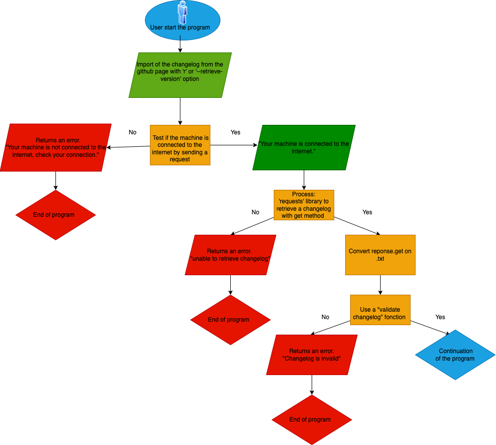
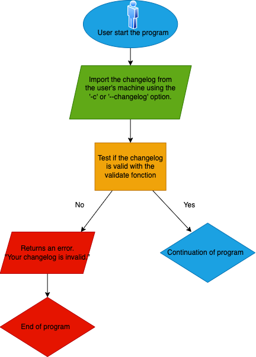
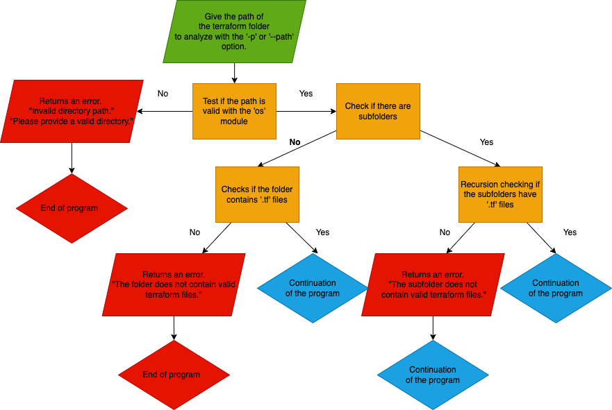
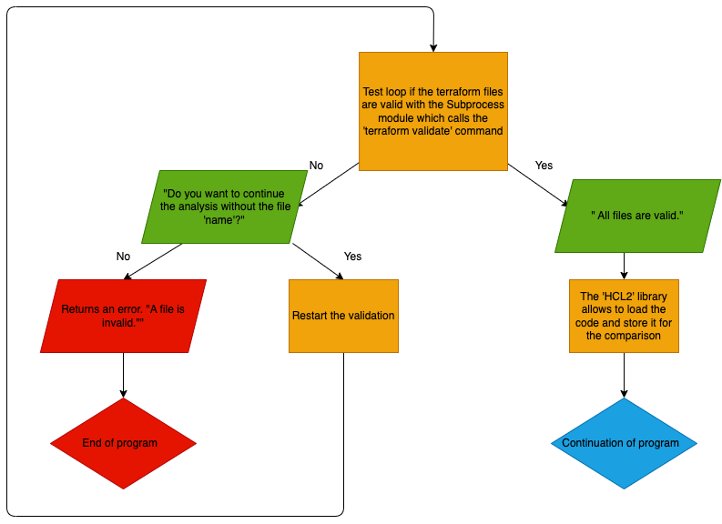
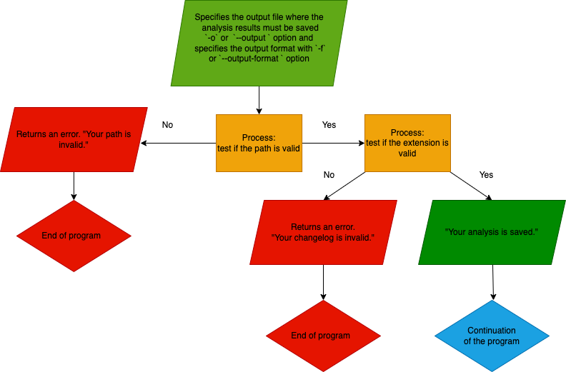
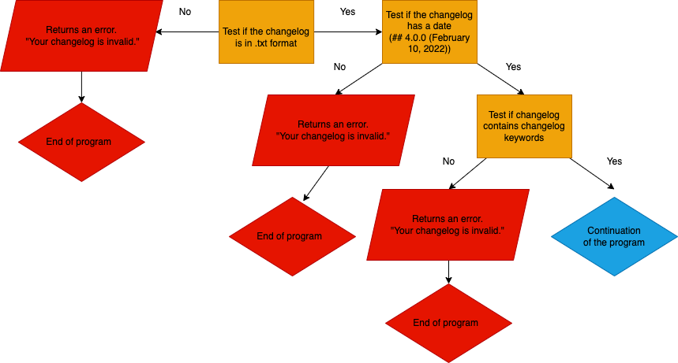

= Technical Specification - Terraform Update Analysis Project with Python

:description: Project Overview
ifdef::env-vscode,env-gitlab[]
include::../partials/_attributes.adoc[]
endif::[]
ifdef::env-site[]
include::partial$_attributes.adoc[]
endif::[]

[abstract]
{description}.

07/24/2023

author: Louis Van Elsuve

For all functional informations, please consult  link:/docs/devops/alternance-lve/EN/T-U-A-P/fonctional-spec.html[the functional specification of the project. ]

== Prerequisites

The project is developed using Python and it requires Python 3 to be installed on the system where the program will run. Ensure that Python 3 is available and properly configured.

=== Cross-platform

The program must be able to run on different OS including windows and Mac OS, this is why it is developed in python with the appropriate libraries.

== Dependencies

Before proceeding with the project workflow, the following Dependencies must be met:

=== HCL2 Library

The project relies on the HCL2 library for analyzing Terraform files. It is necessary to install the HCL2 library with version 4.3.2 as a Python dependency to use it in the program.

=== Requests Library

The 'Requests' module is utilized for retrieving the AWS changelog. To enable this functionality, make sure to have the 'Requests' library version 2.31.0 or later installed in your Python environment.

=== OS Library

The 'OS' library is utilized to retrieve the user's Terraform directory. Python's 'OS' library comes pre-installed with Python 3, so no additional installation is required.

=== Subprocess Library

The "Subprocess" module is utilized to check the validity of the Terraform files that will be used. This module allows the program to execute the "terraform validate" command. The 'Subprocess' module is included in the standard library of Python and does not require separate installation.

=== Re Library 

The "re" or "regular expression" library is used to search for character strings, here this library will be used to search for patterns of dates, versions or even keywords to validate the changelog. 

=== ArgParse library

The "argparse" library is used to facilitate the use of the program, the user enters in input an argument and the value that wishes to give it (like a version, a path, an option)

== Product Requirements

=== User Interface

The user interface of the program must be based on a Command-Line Interface (CLI) for simplified usage. When the user launches the program from their terminal, they must see a welcome message with available options and the arguments they can use.

The user launches the program from the terminal with the `-v` or `--version` option to display the program version.

=== Argument Handling

The program must use `argparse`, an argument management module, to process the arguments provided by the user during program execution. The arguments must allow the user to customize the behavior of the program and provide the necessary information for the Terraform file analysis.

=== Argument Parsing

The program must parse the arguments provided by the user to retrieve the values of specified options, such as the Terraform directory path, changelog file path, version of the changelog to retrieve, output format, etc. The program must also check for missing mandatory arguments and display an appropriate error message.

====

[,CLI]
----
Please provide either -c with a path and -p with a path, or -r with a version and -p with a path.
----
====

=== Fetch remote changelog 

The program uses the `requests` module to retrieve the AWS changelog from the provider's GitHub via the `get` method.

The user wants to retrieve a specific version of the changelog, they use the `-r` or `--retrieve-version` option followed by the desired version number.

The program tests if the user's machine is connected to the internet before retrieving the changelog, if the user does not have internet then the program stops. The program sends a request to a popular site, if the request is successful then it returns the status code 200.

====
No internet connection
[,CLI]
----
Your machine is not connected to the Internet.
----
====

The program checks if the version format is valid.

====
No valid format
[,CLI]
----
Invalid version format. Please use the pattern vX.X.X (e.g., v1.2.3).
----
====

And if the version is not existing, it return a specify error message.

====

[,CLI]
----
Failed to retrieve the changelog for version {version}. Check if the version is valid.
----
====

The program checks if the changelog is valid with the "validate changelog fonction". The paragraph containing the correct version of the changelog is retrieved for analysis.

====

[,CLI]
----
The document is not a valid changelog.
----
====

After the connection test, the program retrieves the changelog, if this is not possible then it returns an error and stops.

=== Fetch local changelog 

The user can specify the path of the text file containing the changelog using the `-c` or `--changelog` option. 

The program checks if the changelog is valid with the "validate changeglog fonction". If not then it returns an error and stops. The paragraph containing the correct version of the changelog is retrieved for analysis.

If it's impossible to fetch the changelog, it return a specify error message.

====

[,CLI]
----
Error: Failed to retrieve changelog content from '{file_path}'.
----
====

=== List versions

Then, the user uses the `-l` or `--list-versions` option to display the list of available versions of the AWS changelog.

=== Terraform File Handling

The user launches the program from the terminal with the `-p` or `--path` option followed by the path of the directory containing the Terraform files to be analyzed.

The program checks the validity of the directory path and displays an error message if the directory does not exist or does not contain valid Terraform files.

====

[,CLI]
----
Error: The directory '{path}' does not exist.

or

Error: '{path}' is not a valid directory.
----
====

If the directory contains subdirectories, the program uses recursion to explore all subdirectories and their subdirectories to find all `.tf` files present in the entire directory tree.

The Terraform files are analyzed using the HCL2 library to extract information about the resources, it need an update for extract informations about modules, and variables used.

The program must traverse the Terraform directory specified by the user to search for files with the ".tf" extension. It must perform checks to ensure that the directory exists and contains valid files. Clear error messages must be displayed in case of errors to inform the user.

====
Example of error message: 

[,CLI]
----
Invalid directory path. Please provide a valid directory.
----
====

If the folder does not contain ".tf" terraform files, it returns a specific message.

====

[,CLI]
----
No Terraform files found in '{directory_path}'.
----
====

=== Terraform File Analysis

The Terraform files are analyzed using the HCL2 library to extract information about the resources, it need an update for extract informations about modules, and variables used.
Relevant information must be extracted for later comparison with the changelog.

The "Sub Process" module allows you to call the "terraform validate" command to validate the terraform code before the comparison.

If one of the terraform files is not valid then the user has the choice to stop the analysis or to continue without this invalid file.

====

[,CLI]
----
The Terraform file is invalid. Do you want to continue without this file? (yes/no):
----
====

If the user write "yes", the program skip the invalid file and continue the analysis wihout the file, and if he write "no", the program stops.

=== Comparison with the Changelog

The program must compare the detected modifications in the Terraform files with the entries in the AWS changelog. It must identify the sentence corresponding to the block of the terraform file to locate de potential updates.

The results must be stored for generating the output.

=== Output Generation

The program must generate a clear and readable output in the form of a formatted text or other extensions, presenting the identified modifications, including resource type, resource name, and occurrence count. 

the user must have a choice on the output with the arguments:

`--no-output`: Executes the analysis without generating any output, useful for checking files without saving the results.

`-q`, `--quiet`: Suppresses information messages and only displays the analysis results.

`-f`, `--output-format`: Specifies the output format (e.g., text, JSON, CSV).

`-o`, `--output `: Specifies the output file where the analysis results must be saved.

If no modifications are detected, an appropriate message must be displayed like: 

====

[,CLI]
----
Updates to be made in Terraform file '/Users/louis.vanelsuve/Desktop/projetTerra/c/invalid.tf':

Update : * resource/aws_elasticsearch_domain: `ebs_options.0.volume_type` can no longer be set to `""`; instead, remove or set to `null` ([#22954](https://github.com/hashicorp/terraform-provider-aws/issues/22954))

Corresponding Terraform block:

example_domain {
  domain_name = "example-domain"
  elasticsearch_version = "7.10"
  ebs_options = [{'ebs_enabled': True, 'volume_type': 'standard', 'volume_size': 10}]
  advanced_options {
    rest.action.multi.allow_explicit_index = "true"
  }
  tags {
    Name = "example-domain"
  }
}
----
====

Or: 

====
[,CLI]
----
No updates needed for Terraform file '{file_path}.
----
====

=== Filtering Options

The program must offer filtering options, such as filtering by modification type (addition, deletion, modification), resource type, module, or Terraform variable. These options must allow the user to customize the analysis results according to their specific needs like:

The `--filter-type TYPE` option allows filtering modifications by type (addition, deletion, modification).

The `--filter-resource RESOURCE` option allows filtering modifications by resource type (e.g., aws_instance, aws_s3_bucket, etc.).

The `--filter-module MODULE` option allows filtering modifications by Terraform module.

The `--filter-variable VARIABLE` option allows filtering modifications by Terraform variable.

=== Changelog Validate Fonction 

The changelog validation function allows you to check if the changelog present on the machine or the changelog retrieved via the github page is valid.

The function checks if the changelog has a date and an update number (## 4.0.0 (February 10, 2022)). It also checks if it is in .txt format and if it has words found in a changelog such as resource names or keywords.

====

[,CLI]
----
The first line of the document does not contain a valid date and version number format.
----
====

or

====

[,CLI]
----
The document is missing the '{keyword}' keyword.
----
====

or

====

[,CLI]
----
The document is not a valid changelog.
----
====

=== Error Handling

The program must have error handling mechanisms to manage cases where the Terraform directory or changelog file does not exist, Terraform files are incorrect, or there are syntax errors. Clear and informative error messages must be displayed to assist the user in resolving encountered issues.

=== Unit Testing and Integration Testing

The program includes unit tests to verify basic functionality, as well as integration tests to validate interaction with the changelog retrieval.

=== User guide, Functional and Technical Specifications

The project includes comprehensive user guide, including installation instructions, usage guidelines, and examples of usage.

A functional and technical specification must be provided with the tool for a total understanding of the project, presenting the objectives of the project, the detailed operation, the stakeholders and all the information representing the project.

== Validation Testing

=== Functional Validation

Functional testing ensures that the various modules or components correctly implement the defined requirements. Tests must be conducted separately on the two changelog retrieval methods, the Terraform directory filter, and the analysis module.

=== Solution Validation

Solution testing ensures that the defined requirements are met from a use case perspective. Each major use case must be validated in isolation, and then all use cases must be validated together. The aim of these tests is to validate the stability of the solution concerning its various modules.

=== Performance and Robustness Validation

Performance tests verify compliance with performance requirements, while robustness tests aim to identify stability and reliability issues over time.

== Program Features

=== Changelog Retrieval

The program allows users to specify the desired changelog version. It automatically retrieves the changelog from the AWS provider's GitHub page using the 'Requests' module with the 'get' method or accepts a user-provided text document.

=== Terraform File Analysis

The program enables users to specify the path to the directory containing the Terraform files to analyze. It validates the directory and filters files with the ".tf" extension for analysis.

=== Modification Comparison

The program utilizes the HCL2 library to analyze Terraform files and compares the detected modifications with the changelog content.

=== Output Generation

The program generates clear and readable output that presents the identified modifications, including resource type, resource name, and the number of occurrences. If no modifications are detected, an appropriate message is displayed.

=== Error Handling

The program handles error scenarios such as invalid directory paths, network errors during changelog retrieval, incorrect Terraform files, or syntax errors.

=== Unit Testing and Integration Testing

The program includes unit tests to verify basic functionality, as well as integration tests to validate interaction with the changelog retrieval.

=== Documentation

The project includes comprehensive documentation, including installation instructions, usage guidelines, and examples of usage.

=== Arguments

Here is a list of arguments that could be present in the Terraform Update Analysis program with Python:

`-h`, `--help`: Displays detailed help on the available program options.

`-v`, `--version`: Displays the program version.

`-p', `--path`: Specifies the path to the directory containing the Terraform files to be analyzed.

`-c`, `--changelog`: Specifies the path to the text file containing the AWS changelog.

`-l`, `--list-versions`: Lists the available versions of the AWS changelog.

`-r`, `--retrieve-version`: Specifies the desired version of the AWS changelog to retrieve.

`-o`, `--output`: Specifies the output file where the analysis results must be saved.

`--filter-type TYPE`: Filters the modifications by type (addition, deletion, modification).

`--filter-resource RESOURCE`: Filters the modifications by resource type (e.g., aws_instance, aws_s3_bucket, etc.).

`--filter-module MODULE`: Filters the modifications by Terraform module.

`--filter-variable VARIABLE`: Filters the modifications by Terraform variable.

`--include-details`: Includes additional details in the output, such as modified lines of code.

`--exclude-path PATH`: Excludes specific files or directories from the analysis.

`--no-output`: Executes the analysis without generating any output, useful for checking files without saving the results.

`-q`, `--quiet`: Suppresses information messages and only displays the analysis results.

`-f`, `--output-format`: Specifies the output format (e.g., text, JSON, CSV).

== Considerations and Potential Challenges

=== Version Compatibility

There might be compatibility issues between Terraform versions and the Python dependencies used in the project. It is important to maintain compatibility with recent versions of Terraform and ensure proper dependency management.

=== Changelog Information Extraction

Utilizing scraping techniques to extract relevant information from the changelog might pose challenges due to the variable structure of the document. It is crucial to establish robust logic for reliable extraction of pertinent information.

=== Program Performance

When analyzing a large number of Terraform files, program performance can be a challenge. It is important to optimize the code to handle a significant volume of files efficiently and conduct performance tests to ensure program responsiveness.

=== Handling Non-Standardized Terraform File Structures

Some Terraform files might not follow a standardized structure, which can make modification comparison more complex. The program must be flexible enough to handle such variations.

=== Error Handling and Exceptional Scenarios

The program must handle network errors during changelog retrieval, incorrect Terraform files, or syntax errors gracefully. Clear error messages and appropriate instructions must be provided to resolve issues encountered by the user.

=== Maintaining Compatibility with AWS Updates

AWS provider updates and modifications are frequent. It is important to monitor these updates and update the program accordingly to maintain compatibility.

=== Dependency Management

Installing the project might involve challenges related to missing or incompatible dependencies. It is important to specify dependencies clearly and provide instructions for correct installation.

=== Supported Platforms

The program must be functional on both Mac and Windows machines, considering potential differences in file paths and system commands.
